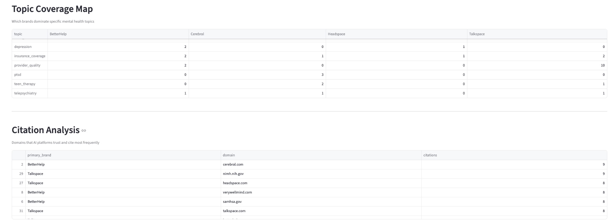

# AI Brand Visibility Tracker - Mental Health Analytics

[](https://www.python.org/downloads/)
[](https://streamlit.io/)
[](LICENSE)
[](https://ai-brand-visibility-tracker-28juw59dgwu24whpl6shr2.streamlit.app/)


## DEMO - **[https://ai-brand-visibility-tracker-28juw59dgwu24whpl6shr2.streamlit.app/](https://ai-brand-visibility-tracker-28juw59dgwu24whpl6shr2.streamlit.app/)**
## System Workflow


*Complete system architecture from data input to business insights*


> **Measure → Diagnose → Recommend → Improve**

Track how mental health brands perform across AI platforms like ChatGPT and Claude. Get actionable insights to improve your brand's visibility in AI-generated responses.

## Dashboard Preview

### AI Visibility Scorecard

*Compare brand performance across AI platforms with proprietary AVS scoring*

### Brand Coverage Analysis  

*See which brands dominate specific mental health topics*

### AI Conversations Map

*Analyze real user questions and brand mentions by theme*

## Key Features

- **AI Visibility Score (AVS)** - Proprietary weighted algorithm (45% placement + 30% citations + 20% coverage + 5% mentions)
- **Cross-platform Analysis** - Monitor brand presence across ChatGPT, Claude, Perplexity
- **Interactive Dashboard** - Professional charts with optimized sizing for executive presentations
- **Topic Coverage Mapping** - Identify which mental health topics your brand dominates
- **Citation Authority Tracking** - Understand which domains AI platforms trust most
- **ML-Powered Question Clustering** - Analyze real user queries with TF-IDF and K-Means
- **Strategic Content Briefs** - Get AI-generated recommendations to improve visibility
- **Compact Data Views** - Streamlined tables with controlled heights for clean presentation

## Quick Start

```bash
# Clone and setup
git clone https://github.com/akhilesh360/ai-brand-visibility-tracker.git
cd ai-brand-visibility-tracker
python -m venv venv
source venv/bin/activate  # Windows: venv\Scripts\activate

# Install and run
pip install -r requirements.txt
streamlit run app/streamlit_app.py
```

Open `http://localhost:8501` to explore the dashboard.

## How It Works

The platform uses machine learning to analyze:
- **Placement scores** in AI responses (45% weight)
- **Citation patterns** across trusted domains (30% weight)
- **Topic coverage** in mental health conversations (20% weight)
- **Brand mention rates** in AI outputs (5% weight)
- **User question clustering** with TF-IDF vectorization and K-Means

## Tech Stack

### Core Technologies
- **Python 3.8+** - Backend language
- **Streamlit** - Interactive web dashboard
- **Pandas** - Data manipulation and analysis
- **Matplotlib** - Professional chart visualization with DPI optimization
- **Scikit-learn** - Machine learning (TF-IDF, K-Means clustering)

### Key Libraries
- **TfidfVectorizer** - Text feature extraction for question analysis
- **KMeans** - Unsupervised clustering of user queries
- **Pathlib** - Modern file path handling

### Architecture
- **Modular Pipeline** - Separate scoring and brief generation modules
- **Caching System** - Streamlit data caching for performance
- **Professional Styling** - Custom chart formatting and brand colors

## Project Structure

```
ai-brand-visibility-tracker/
├── app/streamlit_app.py          # Dashboard application
├── pipeline/
│   ├── score.py                  # AVS calculation engine
│   └── actions_briefs.py         # Content brief generator
├── data/                         # Sample datasets
└── screenshots/                  # Dashboard previews
```

## Contributing

Pull requests welcome! For major changes, open an issue first.

## License

MIT License - see [LICENSE](LICENSE) for details.

## Author

**Sai Akhilesh Veldi**  
[GitHub](https://github.com/akhilesh360) • [LinkedIn](https://www.linkedin.com/in/saiakhileshveldi/)

---

**Made with ❤️ for better mental health AI visibility**
