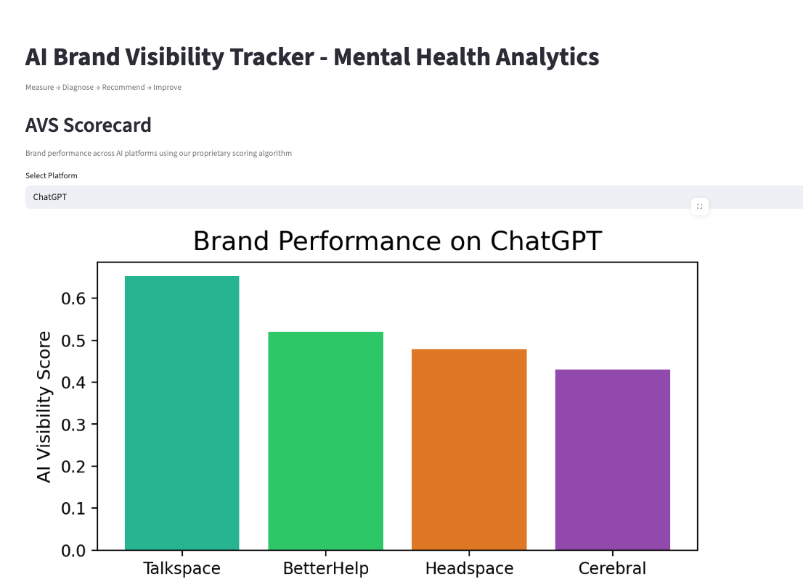
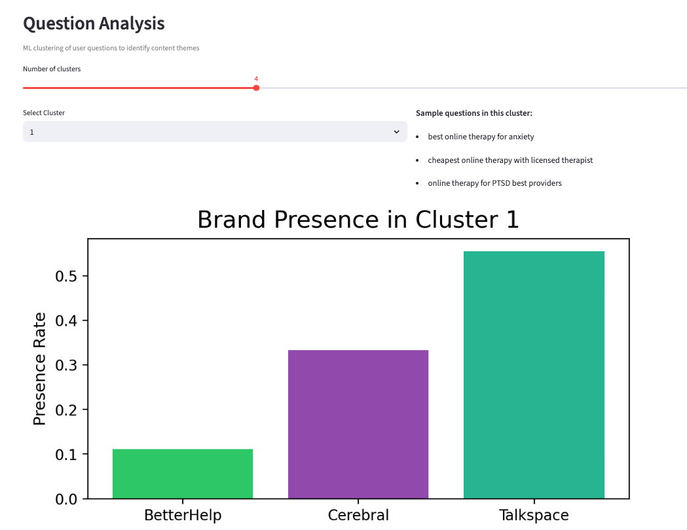

# AI Brand Visibility Tracker - Mental Health Analytics

[](https://www.python.org/downloads/)
[](https://streamlit.io/)
[](LICENSE)
[](https://ai-brand-visibility-tracker-28juw59dgwu24whpl6shr2.streamlit.app/)

## DEMO - **[https://ai-brand-visibility-tracker-28juw59dgwu24whpl6shr2.streamlit.app/](https://ai-brand-visibility-tracker-28juw59dgwu24whpl6shr2.streamlit.app/)**

> **Measure → Diagnose → Recommend → Improve**

Track how mental health brands perform across AI platforms like ChatGPT and Claude. Get actionable insights to improve your brand's visibility in AI-generated responses.

## Dashboard Preview

### AI Visibility Scorecard

*Compare brand performance across AI platforms with proprietary AVS scoring*

### Brand Coverage Analysis  

*See which brands dominate specific mental health topics*

### AI Conversations Map

*Analyze real user questions and brand mentions by theme*

## Key Features

- **AI Visibility Score (AVS)** - Proprietary algorithm tracking brand performance
- **Cross-platform Analysis** - Monitor presence across ChatGPT, Claude, and more
- **Topic Coverage Mapping** - See which mental health topics you dominate
- **Citation Tracking** - Understand which domains AI trusts most
- **Question Clustering** - Analyze real user queries by theme
- **Actionable Briefs** - Get specific recommendations to improve visibility

## Quick Start

```bash
# Clone and setup
git clone https://github.com/akhilesh360/ai-brand-visibility-tracker.git
cd ai-brand-visibility-tracker
python -m venv venv
source venv/bin/activate  # Windows: venv\Scripts\activate

# Install and run
pip install streamlit pandas matplotlib scikit-learn
streamlit run app/streamlit_app.py
```

Open `http://localhost:8501` to explore the dashboard.

## How It Works

The platform uses machine learning to analyze:
- **Placement scores** in AI responses
- **Citation patterns** across trusted domains  
- **Topic coverage** in mental health conversations
- **User question clustering** with TF-IDF and K-Means

📋 **[View Complete Technical Workflow](WORKFLOW.md)** - Detailed system architecture and step-by-step process

🎨 **[Visual Process Flow](VISUAL_WORKFLOW.md)** - Confluence-style diagrams and flowcharts

## Tech Stack

Python • Streamlit • Pandas • Scikit-learn • Matplotlib

## Project Structure

```
ai-brand-visibility-tracker/
├── app/streamlit_app.py          # Dashboard application
├── pipeline/
│   ├── score.py                  # AVS calculation engine
│   └── actions_briefs.py         # Content brief generator
├── data/                         # Sample datasets
└── screenshots/                  # Dashboard previews
```

## Contributing

Pull requests welcome! For major changes, open an issue first.

## License

MIT License - see [LICENSE](LICENSE) for details.

## Author

**Sai Akhilesh Veldi**  
[GitHub](https://github.com/akhilesh360) • [LinkedIn](https://www.linkedin.com/in/saiakhileshveldi/)

---

**Made with ❤️ for better mental health AI visibility**
